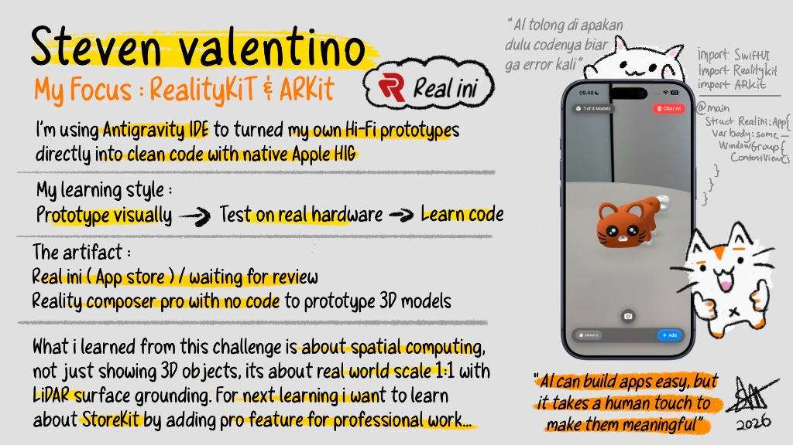

# 🥽 Real ini — True 1:1 AR 3D Model & Booth Visualizer

<p align="center">
  
</p>

<p align="center">
  <strong>The precision AR visualizer for 3D printing makers and exhibition booth designers.</strong><br>
  Measure exact real-world dimensions, slide models across physical surfaces, and pitch designs with adaptive studio lighting.
</p>

<p align="center">
  
  
  
  
  
</p>

---

## 🎨 Developer Spotlight & Personalization

> *"AI can build apps easy, but it takes a human touch to make them meaningful."*  
> — **Steven Valentino (2026)**

<p align="center">
  
</p>

### 👨‍💻 About the Creator
- **Creator**: **Steven Valentino**
- **Focus Areas**: **RealityKit & ARKit** • Spatial Computing • Native Apple HIG
- **Development Philosophy**: Built using **Antigravity IDE** to turn custom high-fidelity prototypes directly into clean, robust Swift code conforming to native Apple Human Interface Guidelines.
- **My Learning Style**:
  ```
  Prototype visually  ➔  Test on real hardware  ➔  Learn code
  ```
- **The Artifacts & Toolchain**:
  - **Real ini**: iOS App Store submission (waiting for review).
  - **Reality Composer Pro**: Rapid zero-code 3D model prototyping and asset preparation.
  - **RealityKit & ARKit**: Millimeter-accurate spatial computing, surface tracking, and raycasting.
  - **SwiftUI**: Dynamic Liquid Glass HUD, grounded bottom sheet drawers, and responsive multi-model control architecture.
- **Core Lesson Learned**: Spatial computing is fundamentally about **physical authenticity**—not merely displaying floating 3D models, but anchoring objects at true **1:1 real-world scale** with precision LiDAR surface grounding.
- **Next Milestone**: Exploring **StoreKit** to introduce Pro tier features for professional commercial designers.
- **Dev Mascot & Inside Story**:
  > *"AI tolong di apakan dulu codenya biar ga error kali 🐱"*

---

## 🚀 Overview

**Real ini** is an augmented reality spatial visualization tool crafted specifically for **3D printing artists, product makers, and exhibition stand designers**. 

Before spending hours of 3D printing time, spool after spool of filament, or building expensive physical trade show booths, **Real ini** allows creators to place `.usdz`, `.usdc`, and `.reality` 3D models into their actual physical environment at true 1:1 scale with LiDAR-backed surface grounding.

---

## ✨ Key Features

### 📏 True 1:1 Scale & Live Dimension Callouts
- Real-time floating dimension badge following Apple HIG sequence: **Width × Length × Height in cm (W × L × H cm)**.
- Fluid pinch-to-zoom scaling from **5% up to 500%** with live dimension recalculations.
- Tactile haptic detent notch that snaps firmly when reaching exact **100% (1:1 true scale)**.

### 🪵 Precision LiDAR Surface Grounding
- Container-space raycasting anchors models flush against floors, desks, and tables (`y = 0.0m`).
- Zero awkward floating or mesh clipping—3D objects feel physically grounded in the room.

### 👆 1-Finger Surface Sliding
- Effortlessly glide placed 3D models across detected horizontal planes at fluid **60 FPS**.
- No frustrating multi-step menus or re-tapping required to adjust placement.

### 🧩 Multi-Model AR Staging
- Place and manipulate up to **4 models simultaneously** within the same spatial scene.
- Active model selection indicator rings, individual delete, and targeted reset capabilities.

### 💡 Scale-Consistent Studio Lighting
- Custom 3-point soft-white studio lighting (Key, Fill, and Top Lights).
- Dynamically self-adjusting illumination that scales with the model, preventing glare or underexposure.

### 🔄 Instant 1:1 Reset
- Restore selected models back to their original 100% scale and neutral orientation with a single tap.

### 📸 Studio Snapshot Camera
- Capture studio-lit AR presentations directly from the scene.
- Features smooth shutter flash animation, sound/haptic feedback, and instant save to the iOS Photo Library.

### 📂 Universal 3D Asset Support
- Seamlessly import `.usdz`, `.usdc`, and `.reality` assets from **Files**, **AirDrop**, or iCloud Drive.
- Includes pre-bundled sample models for instant testing right out of the box.

---

## 🎯 Target Audiences

| Audience | Use Case | Benefits |
| :--- | :--- | :--- |
| **3D Printing Makers** | Verify tabletop clearance, proportion, and overhangs before hitting "Print". | Eliminates wasted filament and hours of failed multi-day prints. |
| **Exhibition Booth Designers** | Pitch full-scale 1:1 pop-up kiosks and backdrops on actual venue floors. | Walk clients through real-scale booth layouts and inspect visitor walkways. |
| **Industrial & Product Designers** | Validate ergonomic dimensions and aesthetic fit in physical environments. | Rapid physical-digital iteration without physical clay mockups. |

---

## 🏗️ Technical Architecture & Tech Stack

```
RealityBooth/
├── RealityBooth2/
│   ├── AR/
│   │   ├── ARViewContainer.swift        # RealityKit ARViewRepresentable coordinator
│   │   └── Managers/
│   │       ├── ARSurfaceManager.swift   # LiDAR raycasting & plane snapping
│   │       └── ARSelectionIndicator.swift # Interactive selection highlight ring
│   ├── App/
│   │   └── RealityBooth2App.swift       # SwiftUI @main entry point
│   ├── Core/
│   │   ├── Constants/ARConstants.swift  # Lighting, scale boundaries & limits
│   │   └── Utilities/UTType+Reality.swift # Type identifiers for 3D file formats
│   ├── Models/
│   │   └── ARModelItem.swift            # AR item entities & built-in sample registry
│   ├── Services/
│   │   ├── ModelFileManager.swift       # Sandboxed file handling for custom imports
│   │   └── PhotoLibraryManager.swift    # High-res snapshot export to Photos
│   ├── ViewModels/
│   │   └── ARViewModel.swift            # State management for multi-model lifecycle
│   └── Views/
│       ├── Main/ContentView.swift       # Root responsive layout & gestures
│       ├── Components/                  # Model picker sheet, loading overlays
│       ├── HUD/                         # Top HUD, instruction banners, scale badge
│       └── Modifiers/LiquidGlassModifier.swift # Native Apple HIG glassmorphism
└── docs/                                # Product landing page, privacy policy & support
```

- **Language**: Swift 5.9+
- **UI Framework**: SwiftUI (iOS 17+ APIs)
- **Spatial Engine**: RealityKit 3 & ARKit
- **State Architecture**: MVVM + Combine
- **File Interop**: UniformTypeIdentifiers (`.usdz`, `.usdc`, `.reality`)
- **System Integration**: Photos Framework, CoreHaptics, UIImpactFeedbackGenerator

---

## 📋 Requirements & Setup

### Requirements
- **macOS Sonoma** or later
- **Xcode 15.0+**
- **iOS / iPadOS 17.0+**
- *Recommended*: iPhone or iPad equipped with a **LiDAR Scanner** (iPhone 12 Pro+, iPad Pro 2020+) for optimal real-time surface grounding.

### Getting Started

1. **Clone the Repository**:
   ```bash
   git clone https://github.com/sevet15/RealityBooth.git
   cd RealityBooth
   ```

2. **Open in Xcode**:
   ```bash
   open RealityBooth/RealityBooth2.xcodeproj
   ```

3. **Select Your Device & Run**:
   - Connect your physical iOS/iPadOS device.
   - Select your Team in **Signing & Capabilities**.
   - Choose the `Real ini` scheme and press **Cmd + R** to deploy.

---

## 🗺️ Roadmap & What's Next

- [x] Multi-model simultaneous placement (up to 4 models).
- [x] Apple HIG floating dimension callouts (`W × L × H cm`).
- [x] 1-finger surface sliding at 60 FPS.
- [ ] **StoreKit Integration**: In-App Purchases for Pro creator features (commercial booth templates, advanced lighting rigs).
- [ ] **Multi-user SharePlay**: Collaborative spatial inspection between designer and client.
- [ ] **Measurement Export**: Export scale-accurate PDF dimension reports.

---

## 🔒 Privacy & Data Policy

- **100% On-Device**: All 3D model rendering, LiDAR scanning, and camera operations occur strictly on the user's local device.
- **No Cloud Uploads**: Your proprietary 3D designs never leave your hardware.
- **No Analytics / No Tracking**: Zero third-party trackers or ad frameworks.
- Read full policy at [docs/privacy.html](docs/privacy.html).

---

## 📬 Contact & Support

Created with passion by **Steven Valentino**.

- **Email**: [stvalentino999@gmail.com](mailto:stvalentino999@gmail.com)
- **GitHub**: [@sevet15](https://github.com/sevet15)
- **Support Page**: [docs/support.html](docs/support.html)

---

<p align="center">
  <sub>© 2026 Steven Valentino. All rights reserved. Real ini is crafted with RealityKit & ARKit.</sub>
</p>
